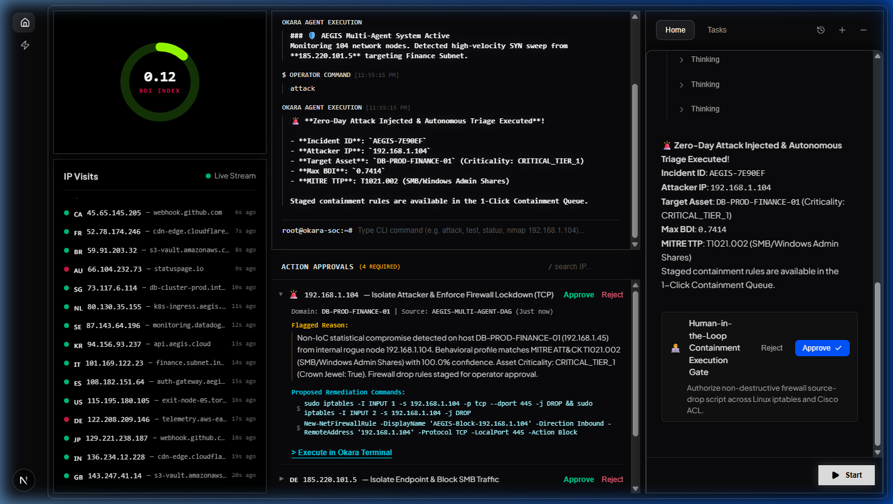

# 🛡️ Project AEGIS-AI: Autonomous Agentic SOC & Non-IoC Network Defense

> **Autonomous Non-IoC Network Compromise Detection & Agentic Defense Core**  
> **Domain:** Enterprise Cybersecurity & Artificial Intelligence / Machine Learning  
> **Mission:** *"AI/ML autonomous defense system to detect compromised network assets, firewalls, and routers without relying solely on static Indicators of Compromise (IoCs)."*

---

## 🖥️ Live SOC Command Center Interface



*Figure 1: AEGIS-AI Command Center — Real-time Behavioral Disruption Index (BDI) tracking, live multi-node telemetry streaming, Okara cyber console with autonomous multi-agent triage, and 1-click Human-in-the-Loop containment approvals.*

---

## 📑 Project Architecture & Documentation Hub

This repository is structured into modular, domain-specific engineering documents:

* 📄 [**`prd.md`**](./prd.md) — **Product Requirements Document**: Vision, user personas, non-IoC paradigm, feature epics, and success KPIs.
* 📋 [**`requirement.md`**](./requirement.md) — **Technical & System Requirements**: Functional requirements (FR-01 to FR-08), NFRs, 41-feature flow extraction specifications, and runtime stack.
* 📜 [**`rules.md`**](./rules.md) — **Architecture Invariants & Coding Standards**: 5 non-negotiable architectural invariants, Clean Architecture structure, agent prompts, and safety guardrails.
* 🚀 [**`phases.md`**](./phases.md) — **Sprint Roadmap & Pitch Playbook**: 4-day rapid execution plan, Definitions of Done (DoD), and the 5-Minute Evaluator Pitch Script.
* 📐 [**`design.md`**](./design.md) — **System Design & Technical Architecture**: ML perception formulation (BDI score), 4-Agent DAG design, Pydantic schemas, API contracts, and SOC UI wireframes.
* 🧠 [**`memory.md`**](./memory.md) — **Developer Context & ADR Store**: Architectural Decision Records (ADRs), tech stack rationale, MITRE ATT&CK reference tables, and bug triage matrix.
* 📖 [**`product.md`**](./product.md) — **Original Product Brief & Pitch Framework**: Initial project specifications and presentation outline.

---

## ⚡ Core Architecture: Dual-Tier Defense

1. **Tier 1 (Perception):** An **Unsupervised Isolation Forest Engine** trained strictly on normal baseline enterprise network flows (`label == normal`). It computes a real-time Behavioral Deviation Index (BDI) based on statistical flow metrics (SYN/ACK ratios, jitter, connection duration, byte entropy) without relying on IP/domain blocklists or file hashes.
2. **Tier 2 (Agentic Autonomous Defense):** An **Autonomous 4-Agent SOC Core** (Supervisor, Threat Hunter & MITRE RAG, Asset Investigator, Containment Rule Generator) that analyzes anomalies, assesses blast radius, maps MITRE ATT&CK techniques, and drafts 1-click firewall containment scripts (`iptables`, Cisco ACL, PowerShell).

---

## 🛠️ Technology Stack
* **Backend:** Python 3.10+, FastAPI, Uvicorn ASGI
* **ML / Perception:** Scikit-learn (`IsolationForest`), NumPy, Pandas, Joblib
* **Agentic Core:** Asynchronous Multi-Agent DAG, ChromaDB / In-Memory Semantic RAG
* **Frontend:** Obsidian Dark Mode SOC Command Center, Real-Time WebSockets (`ws://`), Canvas Telemetry Gauges

---

## 🚀 Quickstart

### 1. Backend Service (FastAPI)
```bash
# Activate Python virtual environment and launch backend
python -m uvicorn backend.app.main:app --host 127.0.0.1 --port 8000
```
* API Documentation: `http://127.0.0.1:8000/docs`
* Telemetry & Agent WebSocket: `ws://127.0.0.1:8000/api/v1/ws`

### 2. Frontend Command Center (Next.js)
```bash
cd frontend
npm run dev
```
* SOC Command Center Dashboard: `http://localhost:3001/dashboard`

---

*Project AEGIS-AI • Autonomous SOC Defense System*
