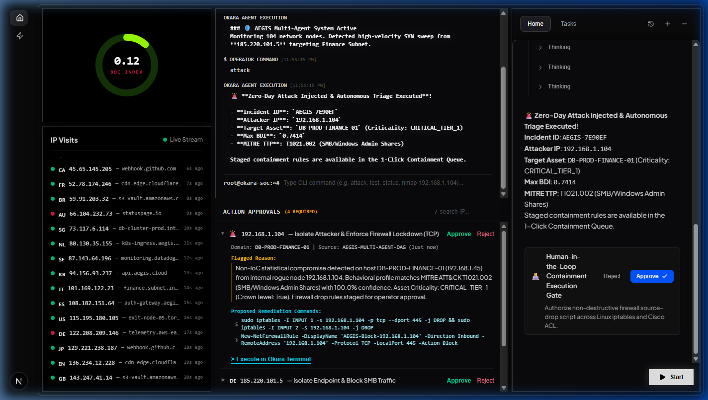
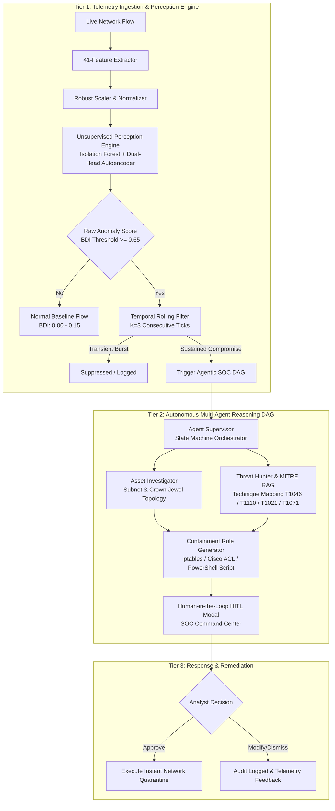

# 🛡️ Project AEGIS-AI: Autonomous Agentic SOC & Non-IoC Network Defense

[](https://www.python.org/)
[](https://fastapi.tiangolo.com/)
[](https://nextjs.org/)
[](https://www.docker.com/)
[](https://pytorch.org/)
[](https://attack.mitre.org/)
[]()

> **Autonomous Non-IoC Network Compromise Detection & Agentic Defense Core**  
> **Domain:** Enterprise Cybersecurity & Applied Artificial Intelligence / Machine Learning  
> **Mission:** *"An autonomous AI/ML defense system engineered to detect compromised network assets, firewalls, and routers without relying solely on static Indicators of Compromise (IoCs), signatures, or known IP blacklists."*

---

## 🖥️ Live SOC Command Center Interface



*Figure 1: AEGIS-AI Command Center — Real-time Behavioral Disruption Index (BDI) tracking, live multi-subnet telemetry streaming, interactive network topology canvas, autonomous multi-agent triage reasoning, and 1-click Human-in-the-Loop containment execution.*

---

## 📑 Documentation Hub

This repository contains full architectural, algorithmic, and engineering documentation:

| Document | Focus & Contents |
| :--- | :--- |
| 📄 [**`prd.md`**](./prd.md) | **Product Requirements Document**: Vision, personas, non-IoC paradigm, feature epics, and success KPIs. |
| 📋 [**`requirement.md`**](./requirement.md) | **System Requirements**: Functional requirements (FR-01 to FR-08), NFRs, 41-feature flow extraction, and runtime stack. |
| 📜 [**`rules.md`**](./rules.md) | **Architecture Invariants**: Strict non-IoC invariants, Clean Architecture separation, agent prompts, and guardrails. |
| 🚀 [**`phases.md`**](./phases.md) | **Sprint Roadmap & Pitch Playbook**: Definitions of Done (DoD) and the 5-Minute Evaluator Pitch Walkthrough. |
| 📐 [**`design.md`**](./design.md) | **System Design & Technical Architecture**: ML perception formulation, 4-Agent DAG design, Pydantic schemas, and API contracts. |
| 🧠 [**`memory.md`**](./memory.md) | **Developer Context & ADR Store**: Architectural Decision Records (ADRs), MITRE ATT&CK reference tables, and bug triage matrix. |
| 📖 [**`product.md`**](./product.md) | **Original Product Brief**: Initial project specifications and presentation outline. |

---

## ⚡ Core Architecture: Dual-Tier Defense


```mermaid
flowchart TB
    subgraph INGESTION ["Tier 1: Telemetry Ingestion & Perception Engine"]
        A[Live Network Flow] --> B[41-Feature Extractor]
        B --> C[Robust Scaler & Normalizer]
        C --> D[Unsupervised Perception Engine\nIsolation Forest + Dual-Head Autoencoder]
        D --> E{Raw Anomaly Score\nBDI Threshold >= 0.65}
        E -- No --> F[Normal Baseline Flow\nBDI: 0.00 - 0.15]
        E -- Yes --> G[Temporal Rolling Filter\nK=3 Consecutive Ticks]
        G -- Transient Burst --> H[Suppressed / Logged]
        G -- Sustained Compromise --> I[Trigger Agentic SOC DAG]
    end

    subgraph AGENTIC_SOC ["Tier 2: Autonomous Multi-Agent Reasoning DAG"]
        I --> J[Agent Supervisor\nState Machine Orchestrator]
        J --> K[Asset Investigator\nSubnet & Crown Jewel Topology]
        J --> L[Threat Hunter & MITRE RAG\nTechnique Mapping T1046 / T1110 / T1021 / T1071]
        K --> M[Containment Rule Generator\niptables / Cisco ACL / PowerShell Script]
        L --> M
        M --> N[Human-in-the-Loop HITL Modal\nSOC Command Center]
    end

    subgraph ACTION ["Tier 3: Response & Remediation"]
        N --> O{Analyst Decision}
        O -- Approve --> P[Execute Instant Network Quarantine]
        O -- Modify/Dismiss --> Q[Audit Logged & Telemetry Feedback]
    end
```

### 1. Tier 1: Non-IoC Perception & Machine Learning
- **Zero Static IoC Reliance**: Traditional defenses depend on IP/domain blocklists and file hashes that fail immediately against zero-days, compromised legitimate credentials, and polymorphic malware. AEGIS-AI measures **pure behavioral telemetry** (connection duration, protocol flags, byte entropy, service dispersion, error rates).
- **Unsupervised Baseline Training**: The anomaly perception models are trained **strictly on benign baseline traffic** (`label == normal`). The system learns what normal enterprise operations look like and identifies anomalous deviations without needing prior exposure to specific attack signatures.
- **Temporal Rolling Filter ($K=3$)**: Single-packet spikes and transient network jitter are filtered through a sliding temporal window. Only sustained anomalous activity across multiple consecutive ticks triggers high-priority alerts, eliminating alert fatigue.

### 2. Tier 2: Autonomous Multi-Agent SOC Reasoning Core
- **Agent Supervisor**: Manages the incident state machine, calculates blast radius across subnets, and broadcasts intermediate thoughts in real-time over WebSockets.
- **Threat Hunter & MITRE RAG**: Correlates behavioral flow vectors with the MITRE ATT&CK knowledge base to identify tactics and techniques (e.g., T1046 Network Service Scanning, T1110 Brute Force, T1021.002 Lateral Movement, T1071 C2 Beaconing).
- **Asset Investigator**: Cross-references affected source and destination IPs with corporate asset inventory to assess asset criticality (Workstations vs. DMZ Gateways vs. Tier-1 Crown Jewels).
- **Containment Rule Generator**: Synthesizes verified, multi-platform containment scripts (`iptables`, Cisco ACL, PowerShell) with rollback procedures, pending Human-in-the-Loop (HITL) approval.

---

## 📊 Machine Learning Model Progression & Benchmarks

All deep learning and ensemble models were developed and evaluated on the standardized NSL-KDD benchmark (22,544 test flows including zero-day attack variants):

| Version | Architecture | Overall Recall | Normal FP Rate | U2R Stealth Recall | Probe Recall | R2L Recall | Notes & Key Capabilities |
| :--- | :--- | :---: | :---: | :---: | :---: | :---: | :---: |
| **V1** | Standard Isolation Forest (Benign Baseline) | 71.40% | 1.95% | 45.0% | 88.0% | 34.0% | Fast baseline, low compute footprint |
| **V3** | Deep PyTorch Autoencoder ($41 \to 24 \to 12 \to 24 \to 41$) | 75.38% | 3.51% | 65.0% | 94.7% | 42.1% | Non-linear latent manifold reconstruction |
| **V5** | Deep SVDD Hybrid Autoencoder | 78.89% | 3.55% | 72.5% | 98.4% | 48.7% | Minimum-volume hypersphere enclosing benign space |
| **V6** | Dual-Head Autoencoder + Directional Loss | **87.89%** | 6.89% | 91.4% | **99.5%** | 56.4% | High recall mode for maximum zero-day detection |
| **V7** | Regularized Dual-Head Autoencoder | **86.53%** | **4.82%** | **93.9%** | 99.0% | **59.5%** | **Production Champion**: Balanced high recall, low FP rate |

> All trained model weights, checkpoints, and benchmark reports are version-controlled in [`backend/models_saved/kaggle_artifacts/`](./backend/models_saved/kaggle_artifacts/).

---

## 🌐 Live Multi-Subnet IP Telemetry Simulation

AEGIS-AI includes a live enterprise simulation environment that streams real IP telemetry across subnets into the detection pipeline:

```
                            [ WAN / INTERNET ]
                198.51.100.23 (APT Recon Bot)
                185.220.101.5 (Cobalt Strike C2 Server)
                45.33.32.156  (Data Exfiltration Drop)
                              │
                       [ DMZ Boundary ]
            172.16.10.20 (Public Nginx Web Portal)
            172.16.10.25 (Corporate Inbound Mail Gateway)
                              │
                 [ Internal Subnet 192.168.1.0/24 ]
      ┌───────────────────────┼────────────────────────┐
      │ Corporate Clients     │ Core Infrastructure    │ Crown Jewels
      │ 192.168.1.101 (Alice) │ 192.168.1.10 (AD / DC) │ 192.168.1.50 (Prod Finance DB)
      │ 192.168.1.102 (Bob)   │ 192.168.1.60 (File SMB)│
      │ 192.168.1.103 (Charlie)
```

### Staged Attack Scenarios

The live telemetry generator cycles through baseline steady-state traffic interspersed with 4 staged attack waves:

1. **Wave 1 — MITRE T1046 (Network Service Scanning):**
   - External IP `198.51.100.23` scans ports across the DMZ web server `172.16.10.20`.
   - BDI increases to `~0.78` (Elevated).
2. **Wave 2 — MITRE T1110 (Credential Brute-Force):**
   - High-frequency POP3/IMAP authentication bursts targeting `172.16.10.25`.
3. **Wave 3 — MITRE T1021.002 (Lateral Movement to Crown Jewel):**
   - Compromised DMZ server attempts SMB pivot into `192.168.1.50` (Production Finance Database).
   - Sustained BDI spikes to `> 0.90` (**Critical Alert**).
   - **Autonomous Multi-Agent DAG triggers automatically**, correlates connection history, maps MITRE tactics, updates the UI canvas, and generates an `iptables` quarantine action card.
4. **Wave 4 — MITRE T1071.001 (Command & Control Beaconing):**
   - Internal workstation `192.168.1.102` beacons out to `185.220.101.5` with uniform timing and byte signatures.

---

## 🚀 Quickstart & Deployment

### Mode A: Full Multi-Container Docker Compose (Recommended)

Spawns the Backend, Next.js Command Center, and the Live Telemetry Generator in isolated containers:

```bash
# Clone the repository
git clone https://github.com/hotshot0104/Aegis.ai.git
cd Aegis.ai

# Launch all 3 services
docker compose up --build
```

- **SOC Command Center Dashboard:** `http://localhost:3000`
- **FastAPI OpenAPI Documentation:** `http://localhost:8000/docs`
- **WebSocket Telemetry Stream:** `ws://localhost:8000/api/v1/ws`

---

### Mode B: Direct Local Development (No Docker Required)

You can launch the live simulation directly on your local machine using the included runner:

```bash
chmod +x run_live_demo.sh
./run_live_demo.sh
```

Or run the components manually across 3 terminal windows:

#### Terminal 1: Backend Service
```bash
# Set up Python virtual environment
python3 -m venv .venv
source .venv/bin/activate
pip install -r requirements.txt

# Start backend ASGI server
uvicorn backend.app.main:app --host 0.0.0.0 --port 8000 --reload
```

#### Terminal 2: Frontend Command Center
```bash
cd frontend
npm install
npm run dev
```
Open `http://localhost:3000` (or `http://localhost:3001` depending on port assignment).

#### Terminal 3: Live IP Telemetry Generator
```bash
# Pure Python standard library — zero external dependencies
python3 docker/generator/traffic_generator.py --backend http://localhost:8000 --interval 0.8 --attack-interval 15
```

---

## 🧪 Testing & Verification

Project AEGIS-AI includes a comprehensive test suite covering the ML perception engine, 41-feature extraction, temporal rolling filters, multi-agent DAG orchestration, and containment generation:

```bash
# Run full test suite
pytest tests/ -v
```

```
============================== 45 passed in 2.14s ==============================
```

---

## 📁 Repository Structure

```
Aegis.ai/
├── docker-compose.yml              # Multi-container orchestration (Backend + Frontend + Generator)
├── run_live_demo.sh                # Dual-mode execution script (Docker or local fallback)
├── requirements.txt                # Python backend dependencies
├── pytest.ini                      # Pytest configuration
├── assets/                         # Dashboard screenshots and architecture diagrams
│
├── docker/
│   ├── Dockerfile.backend          # FastAPI Python 3.12-slim production container
│   ├── Dockerfile.frontend         # Next.js 15 Node 20-alpine multi-stage build container
│   ├── Dockerfile.generator        # Lightweight live IP telemetry stream container
│   └── generator/
│       ├── scenario_ips.json       # Enterprise multi-subnet IP topology catalog
│       └── traffic_generator.py    # Zero-dependency live traffic & attack stream engine
│
├── backend/
│   ├── app/
│   │   ├── main.py                 # FastAPI application entrypoint & lifespan pre-loading
│   │   ├── core/                   # Configuration, security, WebSocket connection manager
│   │   ├── models/                 # Pydantic schemas (Incident, FlowVector, ScoreResult)
│   │   ├── routers/                # API endpoints (telemetry, multi-agent, containment, ws)
│   │   └── services/               # Multi-Agent DAG (Supervisor, Threat Hunter, Asset, Containment)
│   ├── ml_engine/
│   │   ├── anomaly_detector.py     # Unsupervised Isolation Forest & BDI inference engine
│   │   ├── feature_extractor.py    # 41-dimensional network flow feature extractor
│   │   ├── rolling_filter.py       # Temporal rolling filter (K=3 consecutive ticks)
│   │   └── train_model.py          # Benign-only training script
│   ├── models_saved/
│   │   ├── isolation_forest_benign.joblib   # Pre-trained production Isolation Forest model
│   │   └── kaggle_artifacts/                # Deep Autoencoder & SVDD checkpoints (V3 - V7)
│   └── data/
│       ├── asset_inventory.json    # Enterprise asset and subnet classification inventory
│       ├── benign_baseline.csv     # Normal enterprise traffic flow baseline
│       └── mitre_attack_kb.json    # MITRE ATT&CK enterprise tactics & techniques mapping
│
├── frontend/
│   ├── src/
│   │   ├── app/                    # Next.js App Router (dashboard, flows, approvals)
│   │   ├── components/             # SOC widgets, infinite topology canvas, agent console
│   │   └── hooks/                  # WebSocket telemetry & agent subscription hooks
│   └── package.json
│
├── notebooks/
│   └── kaggle/                     # Kaggle cloud training scripts, kernels, and EDA notebooks
│
└── tests/                          # 45 integration, unit, and end-to-end test assertions
```

---

## 🔒 Security & Invariants

1. **Non-IoC Invariant:** Detection decisions are based strictly on statistical flow anomalies, entropy metrics, and behavioral deviation, never solely on static IP/hash blacklists.
2. **Benign-Only Training:** Perception models are trained exclusively on normal baseline traffic (`label == normal`) to guarantee zero-day detection capability.
3. **Human-in-the-Loop (HITL):** Containment scripts (`iptables`, Cisco ACL, PowerShell) are generated autonomously with complete audit trails but require explicit analyst approval before enforcement.
4. **Clean Architecture:** Strict decoupling between telemetry ingestion, unsupervised perception, multi-agent reasoning, and UI presentation layers.

---

## 📄 License & Attribution

Developed as part of **Project AEGIS-AI** — Autonomous SOC Network Defense System.  
Distributed under the [MIT License](LICENSE).
