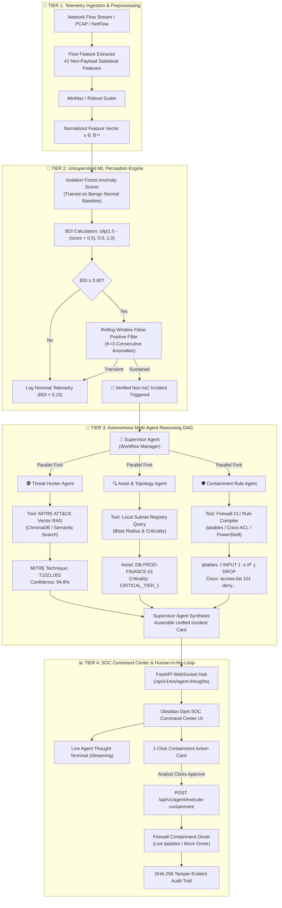

# 📐 PROJECT AEGIS-AI: System Design & Technical Architecture Document

> **Document Code:** `AEGIS-DESIGN-001`  
> **Status:** Baseline Engineering Specification  
> **Architecture Paradigm:** Dual-Tier (Unsupervised ML Perception + Multi-Agent DAG Defense)

---

## 1. High-Level System Architecture



---

## 2. ML Perception Engine Architecture

### 2.1 Theoretical Formulation
Anomalies are detected using the path length in an ensemble of isolation trees. Benign traffic vectors require deep traversals, whereas zero-day statistical anomalies have short path lengths due to low-frequency feature combinations.

$$\text{Anomaly Score } s(x, n) = 2^{-\frac{E(h(x))}{c(n)}}$$

Where:
* $h(x)$: Path length of observation $x$ in tree $T$.
* $E(h(x))$: Average path length across $n$ isolation trees ($n=150$).
* $c(n) = 2\left(\ln(n - 1) + 0.5772156649\right) - \frac{2(n - 1)}{n}$: Average path length of unsuccessful search in a Binary Search Tree (BST).

### 2.2 Behavioral Deviation Index (BDI) Normalization
The raw `decision_function` from Scikit-Learn is converted to an intuitive cybersecurity score in the interval $[0.00, 1.00]$:

```python
def compute_bdi(raw_score: float) -> float:
    # raw_score is typically between -0.5 (extreme anomaly) and +0.5 (very normal)
    inverted = 1.0 - (raw_score + 0.5)
    return float(np.clip(inverted, 0.0, 1.0))
```

### 2.3 Rolling-Window False Positive Filter Algorithm
```python
from collections import deque
import time

class RollingFalsePositiveFilter:
    def __init__(self, window_size: int = 3, time_window_seconds: float = 5.0):
        self.window_size = window_size
        self.time_window_seconds = time_window_seconds
        self.history = {} # ip -> deque of (timestamp, is_anomaly)

    def evaluate(self, ip: str, is_anomaly: bool) -> bool:
        now = time.time()
        if ip not in self.history:
            self.history[ip] = deque(maxlen=self.window_size)
        
        # Purge outdated events
        while self.history[ip] and (now - self.history[ip][0][0] > self.time_window_seconds):
            self.history[ip].popleft()
            
        self.history[ip].append((now, is_anomaly))
        
        # Require K consecutive anomalies within the time window
        if len(self.history[ip]) >= self.window_size:
            return all(flag for _, flag in self.history[ip])
        return False
```

---

## 3. Multi-Agent Orchestration & Data Schemas

### 3.1 Pydantic Core Data Models (`backend/app/models/`)

```python
from pydantic import BaseModel, Field
from typing import List, Optional, Dict
from datetime import datetime

class NetworkFlowVector(BaseModel):
    flow_id: str
    src_ip: str
    dst_ip: str
    src_port: int
    dst_port: int
    protocol: str = "TCP"
    features: List[float] = Field(..., description="41 normalized statistical flow features")
    timestamp: datetime = Field(default_factory=datetime.utcnow)

class AnomalyScoreResult(BaseModel):
    flow_id: str
    bdi_score: float
    is_anomaly: bool
    status: str # "NOMINAL" | "SUSPICIOUS" | "CRITICAL_ANOMALY"
    features_drift: Dict[str, float]

class MitreMapping(BaseModel):
    technique_id: str # e.g. "T1021.002"
    technique_name: str # "SMB/Windows Admin Shares"
    tactic: str # "Lateral Movement"
    description: str
    confidence: float

class AssetProfile(BaseModel):
    ip: str
    hostname: str
    owner_department: str
    criticality_level: str # "CRITICAL_TIER_1" | "MEDIUM" | "LOW"
    os_type: str

class ContainmentRules(BaseModel):
    iptables_rule: str
    cisco_acl: str
    powershell_command: str

class IncidentCard(BaseModel):
    incident_id: str
    timestamp: datetime
    bdi_score: float
    attacker_ip: str
    target_ip: str
    target_port: int
    asset: AssetProfile
    mitre_threat: MitreMapping
    containment: ContainmentRules
    agent_reasoning_summary: str
    status: str = "PENDING_APPROVAL" # "PENDING_APPROVAL" | "CONTAINED" | "DISMISSED"

class ContainmentApprovalRequest(BaseModel):
    incident_id: str
    officer_token: str
    rule_type: str = "iptables" # "iptables" | "cisco" | "powershell"
    approval_action: str = "APPROVE" # "APPROVE" | "REJECT"
```

---

## 4. API Endpoints Specification

| Method | Endpoint Path | Description | Sample Request / Response |
| :--- | :--- | :--- | :--- |
| `POST` | `/api/v1/telemetry/stream` | Ingests real-time flow batch $\to$ runs ML Perception Engine. | **Req:** `NetworkFlowVector`<br>**Res:** `AnomalyScoreResult` |
| `POST` | `/api/v1/telemetry/simulate/normal` | Ingests a pre-built normal baseline traffic burst. | **Res:** `{ "status": "NOMINAL", "bdi_score": 0.07 }` |
| `POST` | `/api/v1/telemetry/simulate/attack` | Injects zero-day SMB lateral attack flow. | **Res:** `{ "status": "CRITICAL_ANOMALY", "bdi_score": 0.94 }` |
| `POST` | `/api/v1/agent/investigate` | Dispatches 4-agent DAG for flagged flow. | **Res:** Full `IncidentCard` JSON |
| `POST` | `/api/v1/agent/execute-containment`| Human-in-the-loop firewall isolation execution. | **Req:** `ContainmentApprovalRequest`<br>**Res:** `{ "status": "CONTAINED", "latency_ms": 780 }` |
| `GET` | `/api/v1/agent/daily-brief` | Returns markdown CISO executive report. | **Res:** Markdown formatted string |
| `WS` | `/api/v1/ws/agent-thoughts` | Live WebSocket stream for real-time agent reasoning thoughts. | **Stream:** JSON events (`agent_name`, `thought`, `tool_out`) |

---

## 5. Frontend SOC Command Center Design System

### 5.1 Color Palette & Design Tokens
```css
:root {
  --bg-primary: #070a13;          /* Deep Obsidian Void */
  --bg-secondary: #0f172a;        /* Midnight Slate */
  --bg-card: rgba(15, 23, 42, 0.75); /* Glassmorphic Slate */
  --border-subtle: #1e293b;       /* Panel Borders */
  --border-glow: #06b6d4;         /* Active Cyan Glow */
  
  --accent-cyan: #06b6d4;         /* Telemetry & Tech Blue */
  --accent-emerald: #10b981;      /* Nominal / Verified Safe */
  --accent-amber: #f59e0b;        /* Warning / Suspicious */
  --accent-crimson: #ef4444;      /* Critical Compromise Alert */
  
  --text-primary: #f8fafc;        /* Crisp White */
  --text-muted: #94a3b8;          /* Slate Grey Subtitles */
  --text-cyan: #38bdf8;           /* High-Contrast Highlights */
  
  --font-mono: 'JetBrains Mono', 'Fira Code', monospace;
  --font-sans: 'Inter', system-ui, -apple-system, sans-serif;
}
```

### 5.2 Command Center Layout Wireframe
```
┌────────────────────────────────────────────────────────────────────────────────────────┐
│ 🛡️ AEGIS-AI COMMAND CENTER  [BDI: 0.12 NOMINAL]  [ZERO-DAY DEFENSE: ACTIVE]  [18:30 UTC]│
├──────────────────────────┬─────────────────────────────┬───────────────────────────────┤
│ 📡 LIVE FLOW TELEMETRY   │ 🤖 AGENTIC THOUGHT TERMINAL │ 🚨 ACTION & CONTAINMENT QUEUE │
│                          │                             │                               │
│ [🟢 Simulate Normal]     │ > [Supervisor] Anomaly 0.94 │ ┌───────────────────────────┐ │
│ [🚨 Inject Zero-Day]     │   detected on 192.168.1.104 │ │ INCIDENT #AEGIS-8821      │ │
│                          │ > [ThreatHunter] Querying   │ │ Host: DB-PROD-FINANCE-01  │ │
│ ┌──────────────────────┐ │   MITRE ATT&CK Matrix...    │ │ Threat: MITRE T1021.002   │ │
│ │  ( ) BDI GAUGE       │ │ > [MITRE] Matched T1021.002 │ │ Criticality: CRITICAL_T1  │ │
│ │      0.94 CRITICAL   │ │   (SMB Lateral Movement)    │ │                           │ │
│ └──────────────────────┘ │ > [Asset] Target is Tier-1  │ │ Rule: iptables -I INPUT 1 │ │
│                          │   Treasury Database Server  │ │   -s 192.168.1.104 -j DROP│ │
│ Flow Logs:               │ > [RuleGen] Formulating     │ │                           │ │
│ • 192.168.1.45:445 SYN   │   containment drop rules... │ │ [ APPROVE & ISOLATE NODE ]│ │
│ • 192.168.1.12:80 OK     │                             │ └───────────────────────────┘ │
└──────────────────────────┴─────────────────────────────┴───────────────────────────────┘
```
