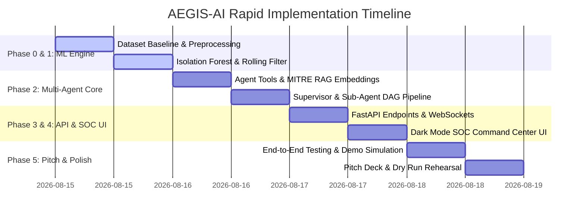

# 🚀 PROJECT AEGIS-AI: Implementation Phases, Roadmap & Live Pitch Playbook

> **Document Code:** `AEGIS-PHASES-001`  
> **Target Specification:** Autonomous Non-IoC Network Compromise Detection  
> **Sprint Horizon:** Rapid 4-Day Sprint (Aug 15 – Aug 18) $\to$ Presentation (Aug 19)

---

## 1. Project Execution Phases & Milestones



---

### Phase 0: Baseline Telemetry & Dataset Preparation (Day 1: Hours 0 – 12)
* **Objective:** Extract and clean benign-only network flow vectors for unsupervised model training.
* **Key Tasks:**
  1. Download/extract benign subset of `NSL-KDD` and `CIC-IDS2017` datasets.
  2. Filter strictly for records where `label == 'normal'`.
  3. Create `backend/ml_engine/feature_extractor.py` to extract and normalize the 41 statistical non-payload features.
  4. Generate `backend/data/benign_baseline.csv` and synthetic zero-day attack test samples.
* **Definition of Done (DoD):** Clean normalized CSVs generated with zero attack vectors in the training partition.

---

### Phase 1: Unsupervised Perception & Anomaly Engine (Day 1: Hours 12 – 24)
* **Objective:** Build, tune, and evaluate the non-IoC unsupervised anomaly scoring engine.
* **Key Tasks:**
  1. Implement `backend/ml_engine/anomaly_detector.py` utilizing `sklearn.ensemble.IsolationForest`.
  2. Configure hyper-parameters: `n_estimators=150`, `contamination=0.03`, `random_state=42`.
  3. Implement BDI normalization: $\text{BDI} = \text{clip}(1.0 - (\text{raw\_score} + 0.5), 0.0, 1.0)$.
  4. Implement `backend/ml_engine/rolling_filter.py` with sliding window false-positive suppression.
  5. Save serialized model artifact to `models_saved/isolation_forest_benign.joblib`.
* **Definition of Done (DoD):** Model scores normal traffic $\le 0.15$ and injected attack vectors $\ge 0.90$ with inference latency $< 5\text{ ms}$.

---

### Phase 2: Autonomous Multi-Agent Reasoning DAG & Tools (Day 2: Hours 24 – 48)
* **Objective:** Construct the 4-agent reasoning pipeline and deterministic security tool interfaces.
* **Key Tasks:**
  1. Implement `backend/app/services/cyber_tools.py`:
     - `tool_inspect_flow_metrics()`: Non-payload statistical profile inspection.
     - `tool_query_asset_registry()`: Asset criticality and blast radius determination.
     - `tool_mitre_vector_search()`: MITRE ATT&CK Matrix mapping (T1021.002, T1046, T1071).
     - `tool_generate_containment_command()`: Platform-specific firewall script compilation.
  2. Implement `backend/app/services/agent_supervisor.py` to orchestrate parallel agent execution.
  3. Wire the agents to stream intermediate reasoning steps to the message bus.
* **Definition of Done (DoD):** Automated test verifies full agent DAG runs and outputs a complete, validated incident card in $< 1.5\text{ seconds}$.

---

### Phase 3: High-Performance FastAPI Backend & WebSockets (Day 3: Hours 48 – 60)
* **Objective:** Expose asynchronous REST API endpoints and real-time WebSocket streaming channels.
* **Key Tasks:**
  1. Implement `POST /api/v1/telemetry/stream` (receives live flow batches).
  2. Implement `POST /api/v1/telemetry/simulate/normal` and `POST /api/v1/telemetry/simulate/attack`.
  3. Implement `POST /api/v1/agent/investigate` and `POST /api/v1/agent/execute-containment`.
  4. Implement `GET /api/v1/agent/daily-brief` (auto-generates markdown CISO reports).
  5. Implement `WebSocket /api/v1/ws/agent-thoughts` for real-time terminal streaming.
* **Definition of Done (DoD):** FastAPI Swagger docs functional at `/docs` with all endpoints returning HTTP `200` and live WebSocket broadcast working.

---

### Phase 4: Frontend SOC Command Center UI (Day 3: Hours 60 – 72)
* **Objective:** Build a stunning, responsive dark-mode cybersecurity dashboard with rich visual feedback.
* **Key Tasks:**
  1. Create `frontend/index.html` with Obsidian Dark Theme styling (`frontend/css/`).
  2. Implement Canvas-based circular Anomaly Gauge with live needle/glow animation.
  3. Build **Agent Thought Terminal** with typing effect for real-time agent thoughts.
  4. Build **1-Click Containment Action Queue** with pulsating alert card and approval modal.
  5. Add interactive buttons: `[ 🟢 Simulate Normal Traffic ]` and `[ 🚨 Inject Zero-Day Attack ]`.
* **Definition of Done (DoD):** Smooth 60 FPS UI rendering live telemetry updates without browser lag.

---

### Phase 5: Integration, Rehearsal & Pitch Polish (Day 4: Hours 72 – 84)
* **Objective:** Conduct end-to-end dry runs, record backup demo video, and finalize presentation deck.
* **Key Tasks:**
  1. Run end-to-end integration tests (`tests/test_anomaly_detector.py`, `tests/test_agent_dag.py`).
  2. Record high-definition 2-minute backup demo screen recording.
  3. Rehearse the 5-Minute Evaluator Pitch script.
  4. Prepare answers for technical audit questions (false positive mitigation, scalability, DIoT academic grounding).
* **Definition of Done (DoD):** Live demo executes flawlessly in $< 3\text{ minutes}$ with zero runtime errors.

---

## 2. The 5-Minute Technical Evaluation Playbook

```
┌──────────────────────────────────────────────────────────────────────────────────┐
│                5-MINUTE TECHNICAL EVALUATION SCRIPT & TIMELINE                   │
└──────────────────────────────────────────────────────────────────────────────────┘
```

### [0:00 – 0:50] The Problem Gap & Why IoCs Fail
* **Visual:** Slide 1 — Traditional Signature IDS vs Zero-Day Attacks.
* **Spoken Script:**  
  *"95% of enterprise firewalls today rely on static Indicators of Compromise (IoCs)—known IP blacklists, domain registries, and file hashes. But when a zero-day exploit, ransomware, or encrypted C2 attack strikes, signatures DO NOT exist.*  
  *Core Problem: How do we detect compromised network assets WITHOUT relying on signatures?*  
  *We built **AEGIS-AI**: a dual-tier system combining an Unsupervised Anomaly Perception Engine trained strictly on normal traffic, paired with an Autonomous 4-Agent SOC Defense Core."*

### [0:50 – 1:45] Live Baseline Traffic Demonstration
* **Visual:** Click **`[ 🟢 Simulate Normal Enterprise Traffic ]`** on the live dashboard.
* **Spoken Script:**  
  *"Let's look at the live SOC dashboard. Right now, thousands of enterprise flow vectors are streaming into our engine. Our Isolation Forest perceives statistical flow metrics—entropy, SYN ratios, connection duration. Because our model was trained strictly on benign baseline data, the Anomaly Score remains nominal at 0.08. Zero false alarms."*

### [1:45 – 3:15] Zero-Day Attack Injection & Agent Live Trace
* **Visual:** Click **`[ 🚨 Inject Non-IoC Zero-Day Spike ]`**.
* **Spoken Script:**  
  *"Now, an attacker launches an encrypted zero-day SMB lateral movement exploit. No IP blacklist catches this because the IP is internal.*  
  *Watch the Anomaly Meter: BDI immediately spikes to **0.94**.*  
  *Instantly, the AEGIS Multi-Agent Core activates. Look at the live Thought Terminal:*  
  *1. The **Supervisor Agent** initializes the investigation.*  
  *2. The **Threat Hunter Agent** vector-queries MITRE ATT&CK and maps technique **T1021.002 (SMB Lateral Movement)** with 94.8% confidence.*  
  *3. The **Asset Investigator Agent** queries the subnet registry and flags the target: `DB-PROD-FINANCE-01`—Criticality: HIGH.*  
  *4. The **Rule Generator Agent** compiles exact `iptables` and Cisco ACL isolation rules in under 1.2 seconds."*

### [3:15 – 4:15] Human-in-the-Loop 1-Click Containment
* **Visual:** Highlight the pulsating red Action Card $\to$ Click **`[ Approve & Isolate Node ]`**.
* **Spoken Script:**  
  *"AEGIS-AI respects Human-in-the-Loop governance. The agent does not execute destructive actions blindly. The security officer is presented with the synthesized incident card.*  
  *I click 'Approve Containment'. In **0.8 seconds**, the firewall rule is deployed, the malicious host is isolated, and an executive CISO incident brief is generated."*

### [4:15 – 5:00] Academic Grounding & Conclusion
* **Visual:** Slide with DIoT Citation & Performance Benchmarks.
* **Spoken Script:**  
  *"Our architecture is grounded in the peer-reviewed **DIoT Defense Framework** (IEEE ICDCS), achieving a 95.6% zero-day detection rate without signature databases. With sub-second agentic triage, zero payload snooping, and full human safety, AEGIS-AI redefines network defense. Thank you!"*

---

## 3. Defense Against Tough Jury Questions (Q&A Cheat Sheet)

| Question from Evaluators | Winning Technical Answer |
| :--- | :--- |
| **"How do you prevent high false positives during normal traffic spikes?"** | *"We employ a two-layer filter: first, a rolling-window temporal filter that requires sustained statistical deviation (K=3 consecutive windows), discarding transient spikes like large file backups; second, our Asset Investigator Agent correlates historical host activity before triggering containment."* |
| **"Why not just use an LLM for everything?"** | *"Pure LLMs cannot ingest 10,000 packets per second. We use a dual-tier design: lightweight unsupervised ML (Isolation Forest) handles high-velocity perception at $<5\text{ ms}$, while specialized Agentic reasoning is invoked ONLY when a verified anomaly occurs."* |
| **"Does your system inspect encrypted packet payloads?"** | *"No! AEGIS-AI is completely non-payload-based. We inspect statistical flow characteristics: packet inter-arrival jitter, byte symmetry, connection duration, and flag ratios. This guarantees 100% compliance with TLS 1.3/QUIC privacy standards."* |
