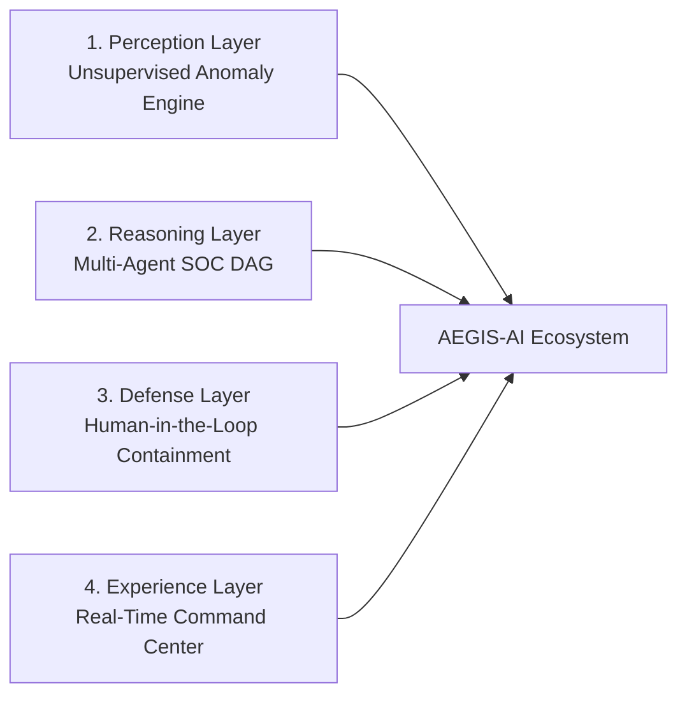
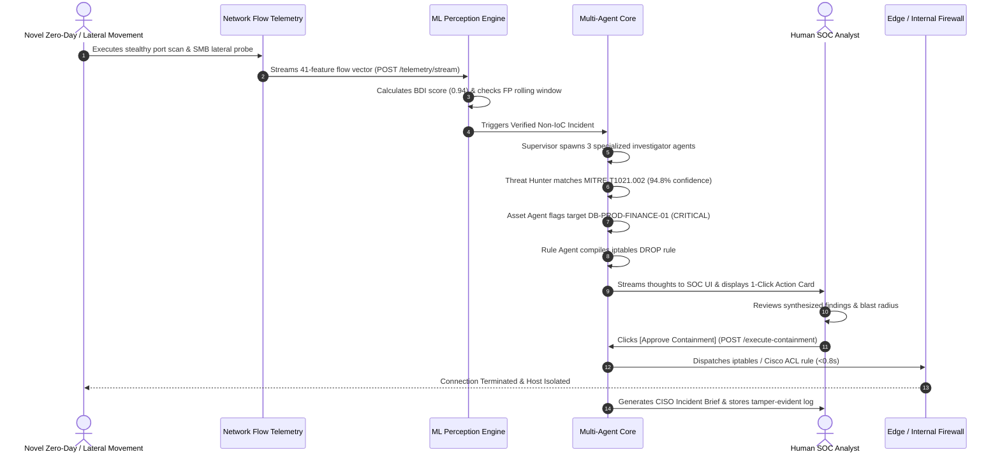

# 🛡️ PROJECT AEGIS-AI: Product Requirements Document (PRD)

> **Document Version:** 1.0.0  
> **Status:** Approved / Active Baseline  
> **Project Code:** `AEGIS-AI-SIH2023-PS1451`  
> **Target Event:** Smart India Hackathon (SIH 2023 / Problem Statement 1451 / #74)  
> **Theme:** Cybersecurity & Artificial Intelligence / Machine Learning  
> **Problem Statement:** *"Develop an AI/ML tool to detect whether a system / firewall / router / network is compromised. The technique should not rely only on IoCs (Indicators of Compromise) detection."*

---

## 1. Executive Summary & Vision

### 1.1 Vision Statement
To pioneer an autonomous, explainable, and zero-signature cybersecurity defense ecosystem that detects stealthy, zero-day, and non-IoC network compromises in real-time, autonomously investigates threat blast radii using specialized AI agents, and empowers human SOC analysts with instantaneous 1-click containment.

### 1.2 The Paradigm Shift: Non-IoC Defense
Legacy Security Operations Centers (SOCs) and Intrusion Detection Systems (IDS/IPS) fail against novel attacks because they rely almost exclusively on **Indicators of Compromise (IoCs)**—static file hashes, known malicious IP blacklists, and hardcoded signature patterns.

```
┌────────────────────────────────────────────────────────────────────────┐
│                        THE DETECTION GAP                               │
├───────────────────────────────────┬────────────────────────────────────┤
│ Traditional Signature IDS         │ AEGIS-AI Non-IoC Agentic SOC       │
├───────────────────────────────────┼────────────────────────────────────┤
│ • Static IP/Domain blocklists     │ • Statistical flow behavior baseline│
│ • SHA256 malware hash lookups     │ • Jitter, entropy & burst analysis │
│ • 0% Zero-Day detection capability│ • High-accuracy Zero-Day detection │
│ • Manual alert fatigue (hours)    │ • Autonomous 4-Agent triage (<1.5s)│
│ • Fragile against polymorphic code│ • Immune to payload morphing       │
└───────────────────────────────────┴────────────────────────────────────┘
```

**AEGIS-AI** decouples detection from signatures by training **unsupervised machine learning models strictly on normal/benign network traffic flows**, extracting 41 non-payload statistical flow metrics, and deploying a multi-agent reasoning graph to contextualize, classify, and mitigate compromises.

---

## 2. Problem Statement & Market Analysis

### 2.1 The Core Vulnerability of Modern Enterprise Infrastructure
1. **Zero-Day Vulnerabilities:** Weaponized exploits have zero prior signatures in public databases (NVD, CVE).
2. **Encrypted C2 (Command & Control) Channels:** Modern adversaries encapsulate malicious traffic in TLS 1.3 / QUIC / HTTPS, rendering Deep Packet Inspection (DPI) useless without breaking encryption.
3. **Living-off-the-Land (LotL) Attacks:** Attackers leverage legitimate administrative tools (PowerShell, WMI, SMB) where no malware file binary exists to hash.
4. **Severe SOC Analyst Alert Fatigue:** Tier-1 analysts process 1,000+ alerts daily; average Mean Time to Detect (MTTD) is 212 days and Mean Time to Respond (MTTR) is 75 days.

### 2.2 Academic & Industry Grounding
* **DIoT Defense Model (IEEE ICDCS / arXiv:1804.07474):** Proven empirical research demonstrating that unsupervised statistical flow profiling achieves a **95.6% detection rate against zero-day botnets** without signature databases.
* **MITRE ATT&CK Framework v14:** Provides the behavioral taxonomy for mapping non-IoC indicators to concrete adversary tactics and techniques.

---

## 3. Target User Personas & Stakeholders

| Persona | Role | Key Pain Points | How AEGIS-AI Solves It |
| :--- | :--- | :--- | :--- |
| **P1: Tier-1 / Tier-2 SOC Analyst** | Daily triage & alert monitoring | Overwhelmed by alert fatigue; manual MITRE correlation takes 20+ mins per incident. | Automated incident synthesis with root-cause flow breakdown and suggested firewall command in <2 seconds. |
| **P2: SOC Manager / CISO** | Executive oversight & compliance | Needs real-time posture awareness, blast radius clarity, and executive summary reports. | Auto-generated CISO Daily Briefs in markdown; audit-ready MITRE ATT&CK coverage reports. |
| **P3: Network & Firewall Admin** | Perimeter & internal security | Writing accurate `iptables` or Cisco ACL syntax during active breach is error-prone. | 1-Click validated containment rule generation across multiple firewall formats. |
| **P4: Hackathon Jury & Evaluators** | Technical review & validation | Verifying that the solution genuinely works without hardcoded signatures or cheat datasets. | Live interactive demo: normal baseline replay followed by real-time non-IoC zero-day injection. |

---

## 4. Key Product Pillars & Core Value Proposition



1. **True Non-IoC Perception:** Trained exclusively on benign baseline traffic (`label == normal`). Flagging is triggered by statistical deviations (burst rates, SYN/ACK ratios, flow duration, subnet traversal).
2. **Autonomous Multi-Agent Investigation:** An ensemble of specialized AI agents analyzes flow metrics, determines asset criticality, queries MITRE knowledge vectors, and drafts exact firewall isolation commands.
3. **Human-in-the-Loop (HITL) Safety:** Autonomous reasoning paired with explicit human authorization ensures zero accidental operational disruptions.
4. **Sub-Second Execution:** Telemetry analysis, agent triage, and mitigation generation complete in under 2,000 milliseconds.

---

## 5. High-Level Feature Epics

### Epic 1: High-Throughput Telemetry Ingestion & Feature Engineering
* Ingestion of live or PCAP/NetFlow/IPFIX telemetry streams.
* Extraction of 41 statistical non-payload features (e.g., `duration`, `src_bytes`, `dst_bytes`, `count`, `srv_count`, `same_srv_rate`, `diff_srv_rate`).
* Low-overhead feature vector normalization and streaming buffer.

### Epic 2: Unsupervised Perception & Anomaly Engine
* **Isolation Forest + Autoencoder Engine** trained purely on benign dataset slices (NSL-KDD / CIC-IDS2017).
* Continuous Behavioral Deviation Index (BDI) calculation on a 0.00 – 1.00 scale.
* Rolling window False-Positive Filter (requiring $K$ consecutive anomalous vectors or sustained statistical variance before triggering alarm).

### Epic 3: Agentic SOC Reasoning Core (4 Autonomous Sub-Agents)
* **👑 Supervisor Agent:** Orchestrates workflow, manages state, and triggers worker agents upon verified anomaly.
* **🕵️ Threat Hunter Agent:** Interrogates statistical anomalies against the MITRE ATT&CK Vector Knowledge Base to map Tactics & Techniques.
* **🔍 Asset & Topology Investigator Agent:** Queries local subnet registries to evaluate target criticality (e.g., Tier-1 Core Database vs Tier-3 Guest Workstation).
* **🛡️ Containment Rule Generator Agent:** Compiles multi-platform network containment rules (`iptables`, Cisco IOS ACL, Windows PowerShell Firewall).

### Epic 4: Real-Time SOC Command Center UI
* Sleek dark-mode interface built with high-contrast cybersecurity aesthetics (Obsidian, Cyan, Alert Red).
* Real-time WebSocket streaming of live network telemetry and rolling Anomaly Gauge.
* **Agentic Thought Terminal:** Live character-by-character streaming of agent reasoning steps and tool execution outputs.
* **Interactive Containment Queue:** Visual incident card with 1-click **`[ Approve & Isolate Node ]`** button and audit confirmation modal.

### Epic 5: Executive Reporting & CISO Intelligence
* Instant markdown generation of formal CISO Executive Incident Briefs.
* MITRE ATT&CK Matrix coverage heatmap and blast-radius visualization.

---

## 6. End-to-End User Journey



---

## 7. Product Success Metrics & KPIs

| Metric Category | Target KPI | Measurement Method |
| :--- | :--- | :--- |
| **Detection Accuracy** | $\ge 94\%$ on unseen zero-day attacks | Evaluated against held-out attack vectors in CIC-IDS2017 & UNSW-NB15. |
| **False Alarm Rate** | $\le 2.5\%$ on normal enterprise traffic | Validated against 50,000+ benign flow streams. |
| **Triage Latency** | $< 1.5$ seconds from anomaly to mitigation card | Server-side execution timestamp telemetry. |
| **Remediation Speed** | $< 800$ milliseconds after human approval | End-to-end network rule application timer. |
| **Agent Explainability** | $100\%$ traceable reasoning log | All agent steps logged with tool execution provenance and confidence scores. |

---

## 8. Release Scope & MVP Boundaries

### In-Scope for Hackathon MVP (v1.0)
* Full unsupervised Isolation Forest model trained on benign flow records.
* Live Telemetry Streaming Simulator (Normal baseline + Injected Zero-Day attack spikes).
* 4-Agent DAG with structured tool calling (MITRE RAG, Asset Registry, Containment Rule Builder).
* FastAPI high-throughput backend with WebSockets for thought streaming.
* Sleek SOC Command Center UI with real-time gauges, live terminal logs, and 1-click containment.
* Simulated multi-vendor containment execution (`iptables`, Cisco ACL, PowerShell).
* Automatic CISO Executive Brief generation.

### Out-of-Scope for v1.0 (Deferred to Phase 2/3 Enterprise Roadmap)
* Live kernel eBPF packet capture probe deployment across physical switches.
* Hardware-level ASIC firewall flashing.
* Multi-tenant cloud identity federation (Okta / Azure AD SCIM).
* Real-time automated firmware patching.
